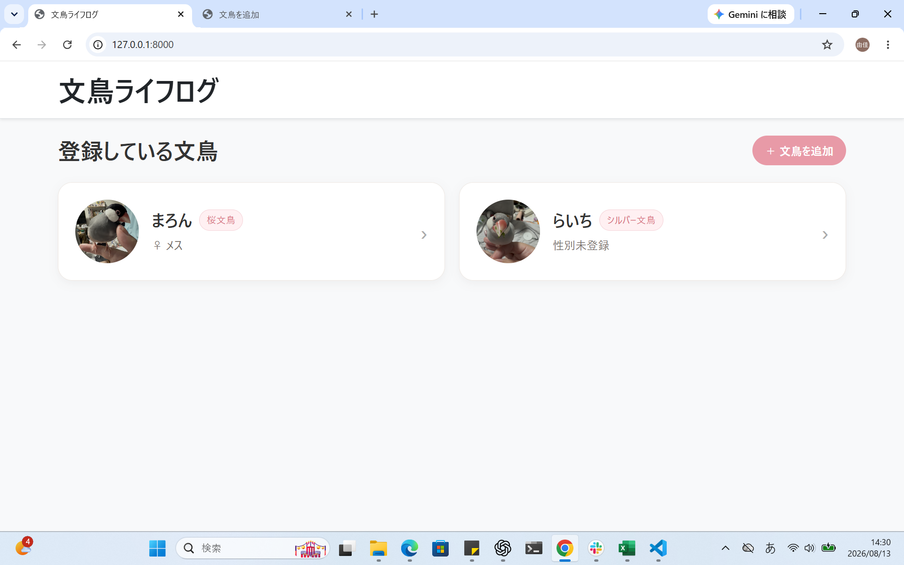
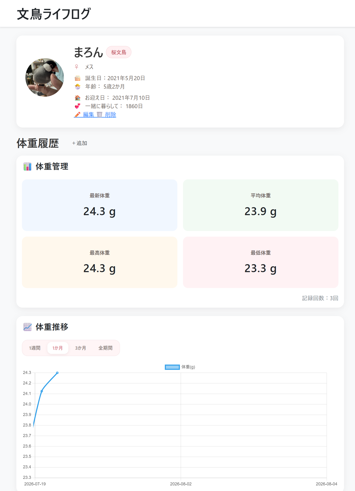
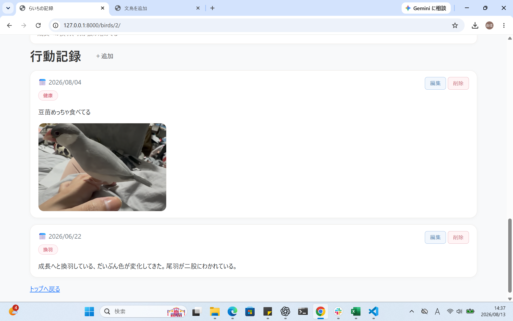

# 🐦 文鳥ライフログ

文鳥の日々の健康状態や行動を記録・管理するためのWebアプリです。

体重や行動を継続的に記録し、変化を分かりやすく確認できるようにすることを目的として制作しました。

## 📌 制作背景

文鳥を飼育する中で、体重や換羽、発情、食事などの日々の変化を記録しておくことの重要性を感じていました。

しかし、記録が複数の場所に分かれていると、過去の状態との比較や長期的な変化の確認が難しくなります。

そこで、

- 文鳥ごとに情報を管理する
- 体重の変化をグラフで確認する
- 日々の行動や体調を写真と一緒に残す

ことができるWebアプリを制作しました。

## 🖥️ 画面イメージ

### 文鳥一覧

### 文鳥詳細・体重管理

### 行動記録

## ✨ 主な機能

### 🐤 文鳥プロフィール管理

- 文鳥の新規登録
- プロフィール編集・削除
- 名前
- 種類
- 性別
- 誕生日
- お迎え日
- プロフィール写真
- 年齢の自動計算
- お迎え日からの経過日数の自動計算

### ⚖️ 体重管理

- 体重記録の追加
- 体重記録の編集・削除
- 最新体重の表示
- 平均体重の表示
- 最高体重・最低体重の表示
- 前回記録との体重差の表示
- 体重推移のグラフ表示

### 📈 体重グラフ

Chart.jsを使用して、体重の変化を折れ線グラフで可視化しています。

表示期間を以下から切り替えることができます。

- 1週間
- 1か月
- 3か月
- 全期間

短期間の変化だけでなく、長期的な体重推移も確認できるようにしました。

### 📝 行動記録

日々の行動や体調について記録できます。

記録できるカテゴリ：

- 換羽
- 発情
- 健康
- 通院
- 放鳥
- 食事
- その他

各記録には、

- 日付
- カテゴリ
- メモ
- 写真

を登録できます。

記録後の編集・削除や、登録した写真の変更にも対応しています。

## 🛠 使用技術

- Python
- Django
- HTML
- CSS
- Bootstrap
- JavaScript
- Chart.js
- SQLite
- Pillow
- Git / GitHub

## 💡 工夫した点

### 1. 体重変化を視覚的に確認できるようにした

単純に体重を一覧表示するだけでは変化を把握しにくいため、Chart.jsを使用してグラフ化しました。

さらに、1週間・1か月・3か月・全期間から表示期間を選択できるようにし、目的に応じて体重の変化を確認できるようにしました。

### 2. 数値だけでなく行動も記録できるようにした

文鳥の健康状態を確認する際には、体重だけではなく、

「換羽している」
「食欲がある」
「発情行動がみられる」

といった日々の行動も重要だと考えました。

そこで、カテゴリとメモを使って行動を記録できる機能を実装しました。

### 3. 写真を使って状態を残せるようにした

文章だけでは残しにくい変化も記録できるよう、プロフィールと行動記録に画像アップロード機能を実装しました。

特に換羽や見た目の変化など、後から写真で比較したい記録にも利用できるようにしています。

### 4. 継続して使いやすいUIを意識した

毎日・定期的に使用することを想定し、カード形式のレイアウトやアイコン、色分けなどを取り入れました。

また、複数の文鳥を登録して、それぞれのプロフィール・体重・行動記録を個別に管理できる構成にしました。

## 📚 制作を通して学んだこと

Djangoを使用したCRUD処理だけでなく、

- データベースに保存したデータの集計
- データの期間指定
- JavaScriptへのデータ受け渡し
- Chart.jsによる可視化
- 画像ファイルのアップロード・表示
- CSS / Bootstrapを使ったUI調整
- Git / GitHubを利用したバージョン管理

など、Webアプリ開発の一連の流れを実践することができました。

## 🔮 今後の改善案

今後さらに機能を追加する場合は、

- 体重変化が大きい場合のアラート表示
- 行動記録の検索・絞り込み
- 写真の表示位置・トリミング調整
- データのCSV出力
- より長期間のデータ分析

などを検討しています。

## 🎯 制作目的

DjangoによるWebアプリ開発の知識を深めるとともに、日々蓄積されるデータを「記録するだけ」で終わらせず、集計・可視化して活用することを目的として制作しました。
